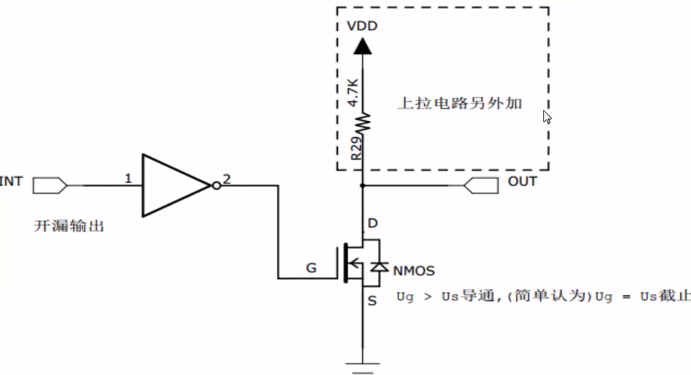

# 推挽输出与开漏输出

简单介绍一下推挽输出和开漏输出的概念。

<!-- more -->

## 推挽输出 (Push-Pull Output)

### 定义

推挽输出是一种双极性输出类型，它使用两个晶体管（通常是MOSFET或BJT）来驱动输出。一个晶体管用于拉低输出（将其连接到低电平，如0V），而另一个晶体管用于拉高输出（将其连接到高电平，如VCC）。

### 特性

- 输出信号具有高低两个明确的电平，通常是VCC和0V。
- 由于两个晶体管同时工作，所以切换速度快。
- 可以直接驱动大多数类型的负载，包括LED、马达等。

### 应用

推挽输出在许多微控制器和标准逻辑门电路中都很常见。

## 开漏输出 (Open-Drain Output)

### 定义

开漏输出只使用一个晶体管（通常是N型MOSFET或NPN BJT）来驱动输出。这种输出类型的最大特点是，当晶体管不导通时，输出引脚是开放的（即不连接到任何电源或地线），而不是被拉低到低电平。

### 特性

- 输出信号通常只能被拉到低电平（例如0V），而不能被直接拉到高电平（VCC）。要将其拉到高电平，通常需要外部上拉电阻或电源。
- 由于只有一个晶体管在工作，所以开漏输出的驱动能力通常比推挽输出弱。
- 由于输出引脚在不使用时是开放的，所以它可以与其他开漏输出共享同一上拉电阻，这在需要多个输出引脚连接到同一电平时非常有用。
- 开漏输出通常用于需要特殊电平转换或需要与其他电路（如逻辑门或微控制器）接口的应用中。

### 应用

开漏输出在需要多个输出共享同一电平的场合（如I2C总线）或需要特殊电平转换的场合（如与5V逻辑电路接口的3.3V微控制器）中非常常见。

