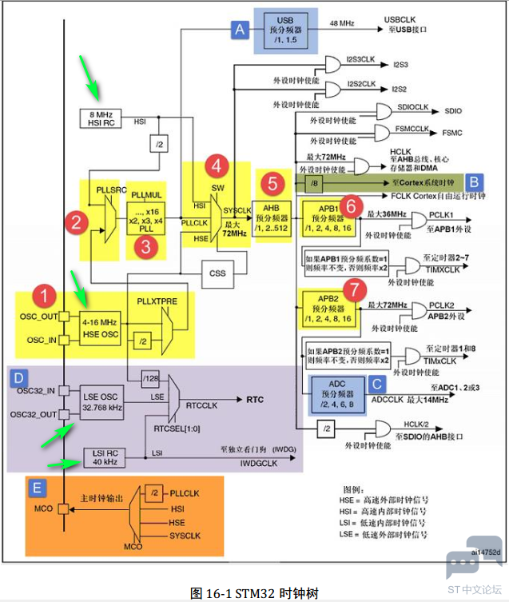

# stm32 时钟树

介绍 stm32 时钟树的概念，并通过设置 `RCC (Reset Clock Control)` 相应的寄存器，配置外设时钟工作模式，并通过示波器观察和检测配置情况。

<!-- more -->

## 基本时钟源

1. ==HSI==，高速内部时钟，RC振荡器，8MHz。
2. ==HSE==，高速外部时钟，石英/陶瓷振荡器，8MHz。
3. ==LSI==，低速内部时钟，RC振荡器，40KHz。
4. ==LES==，外部外部时钟，RTC石英晶振，32.768KHz。

> 内部是指芯片内部集成的时钟源，外部是指芯片外部引脚连接的时钟源。

## 时钟分频器

1. ==PLL==，锁相环，通过倍频和分频，产生高频时钟。
2. 

## 时钟配置
